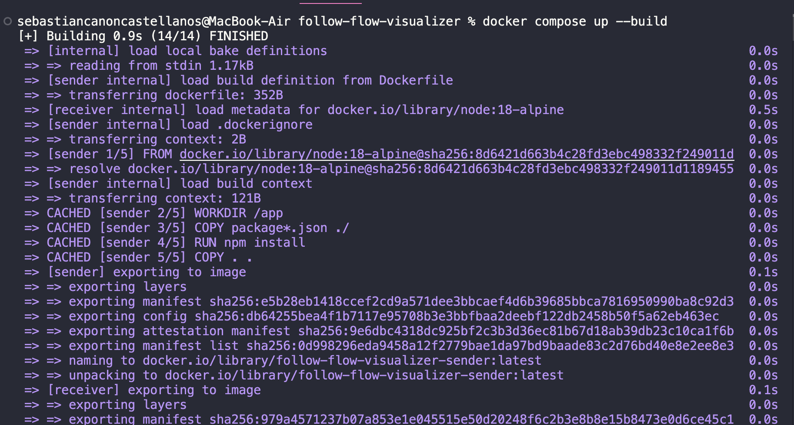

# Tutorial RabbitMQ - Hola Mundo

Tutorial básico de mensajería con RabbitMQ usando Node.js y Docker.

## ¿Qué hace?

- **Productor (send.js)**: Envía mensaje "Hello World!" a una cola
- **Consumidor (receive.js)**: Escucha y recibe mensajes de la cola
- **RabbitMQ**: Servidor que maneja los mensajes entre aplicaciones

## Ejecutar el proyecto

### 1. Iniciar todos los servicios
```bash
docker-compose up --build
```



### 2. Ejecutar sender por separado
```bash
docker-compose up --build sender -d
```


### 3. Ejecutar receiver por separado
```bash
docker-compose up --build receiver -d
```


### 4. Ver los mensajes
```bash
docker-compose logs sender receiver
```


## Estructura del proyecto
```
follow-flow-visualizer/
├── rabbit/
│   ├── send.js      # Envía mensajes
│   ├── receive.js   # Recibe mensajes
│   └── Dockerfile
├── docker-compose.yml
└── resources/       # Capturas de pantalla
```

## Acceso Web
- **RabbitMQ Management**: http://localhost:15673
- **Usuario**: admin
- **Contraseña**: password